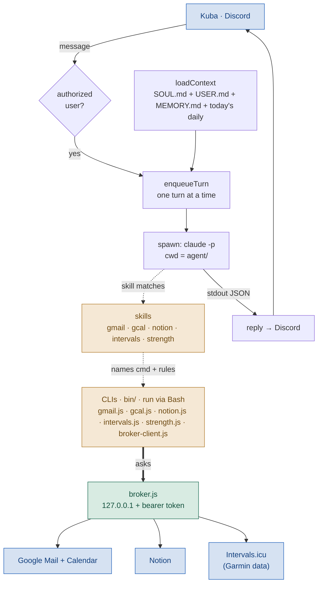
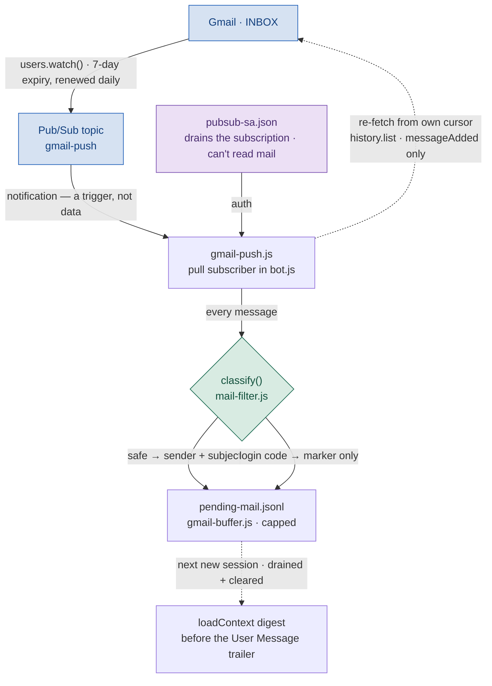
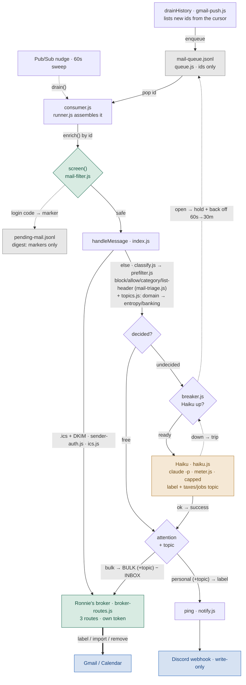
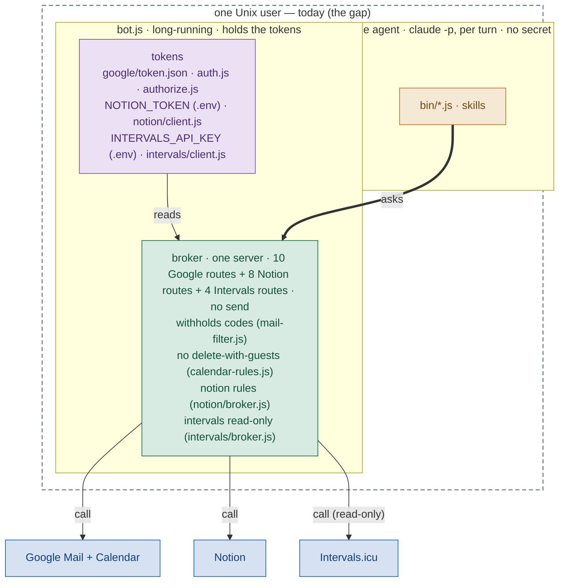
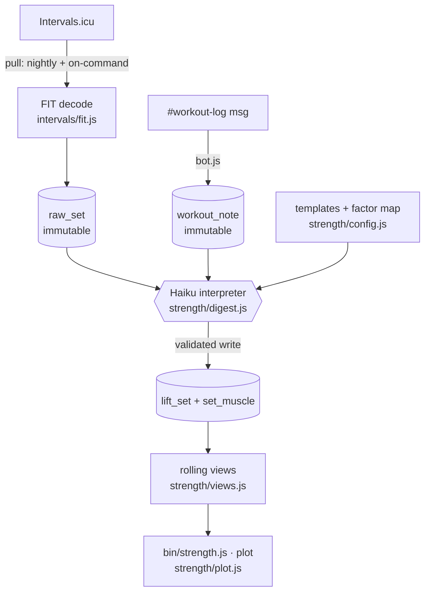
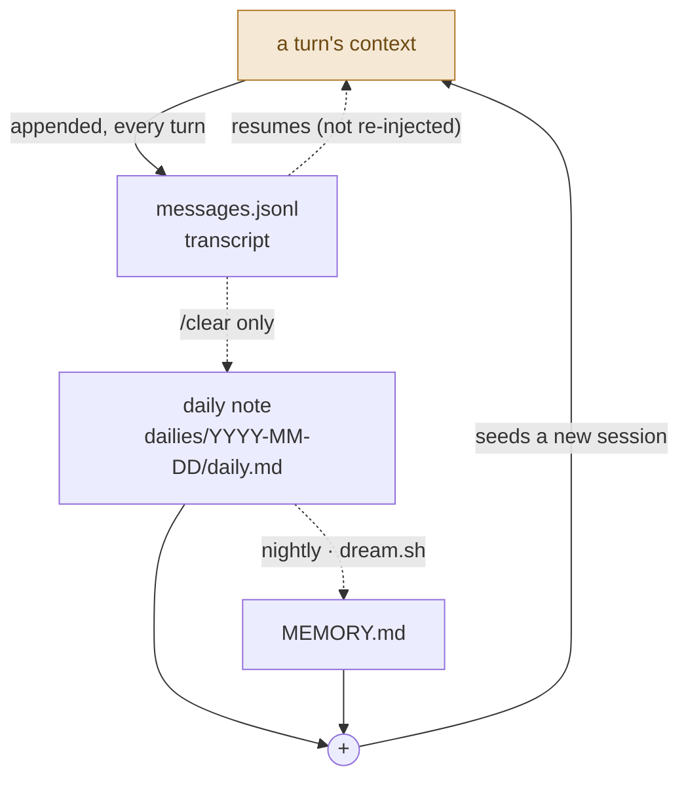

# System map

What Alfred is today — the reference for *"where would that change go?"* Plans
live in `TODO.md`. Update this in the same PR as a change *to the system it
draws* — dev-side work like tooling or these docs touches nothing here;
`npm run map:check` catches real drifting. Diagrams are Mermaid, so they diff as text.

This is the thing to point at when weighing how to build something: name where
on the map a change lands, and which boxes or arrows it adds, moves, or deletes.

---

## Reading this map

One grammar, consistent across every diagram — learn it once.

**Node colour = what a thing is.**

| colour | kind |
|---|---|
| blue | external service — Discord, Google, Notion |
| green | gateway — the broker, the one guarded way out |
| violet | a secret — a token at rest |
| sand | the agent — `claude -p`, its skills and CLIs |
| grey | an internal step or a store |

**Arrow = how strong the link is.**

| line | meaning |
|---|---|
| solid | flow, or a call that happens on the turn |
| thick | the one **guarded crossing** — the agent's authenticated request into the broker |
| dotted | indirect — conditional (on match, `/clear`), scheduled (nightly), or context-only (resume) |

**Structure, not colour, carries the trust boundary.** The dashed box in
Credentials is "one Unix user, today" — the gap we mean to split, drawn as a box
rather than a warning colour.

**A stack of cards means several of one kind, one per service** — skills and
CLIs each fan out to gmail / gcal / notion.

**One gateway is one box.** There is a single broker; its route table merges
every service. Never a broker per service.

**Say which links are guarantees.** A rule enforced in `bot.js` code — no send
route, withheld codes, no guest-deletes — is a guarantee no prompt can undo; a
rule that lives only in a skill body is guidance. Where the difference matters,
the map makes clear which kind it is (green is the guarantee colour).

---

## A turn

There is no Alfred between turns. `runClaude` spawns a fresh `claude -p`, it
answers, it exits.



The `bin/` CLIs are **never loaded into context** — the agent's tools are only
`Bash,Read,Edit,Write`, and it *runs* the CLIs as subprocesses. `SOUL.md` (always
injected) names them; a matching skill body adds the rules `--help` can't express
(Eastern time, colour categories, "withheld means stop"). So the chain is:
instructions name a command → the agent runs it via `Bash` → the CLI asks the
broker. The CLI is downstream and executed, not a thing that sits in the prompt.

The spawn, in full — the token reaches the agent through the environment, never
disk:

```sh
claude -p "<user message>" \
  --output-format json \
  --allowedTools Bash,Read,Edit,Write \
  --dangerously-skip-permissions \
  --resume <sessionId>
# cwd = agent/    env: ALFRED_BROKER=<loopback url>  ALFRED_BROKER_TOKEN=<per-boot secret>
```

## Inbound mail (Pub/Sub)

The second way something enters the system — and unlike a turn, no agent runs.
Gmail publishes a change notification, `bot.js` pulls it, and the result is only
a line in a buffer that the *next* new session reads. Mail arriving decides what
a turn already knows; it never causes a turn. This is "tier 1" in `TODO.md`.



Four properties this path is built to hold, each matching a way it fails silently
if you get it wrong (`TODO.md` spells out the failure modes):

- **The notification is a trigger, not data.** Its payload is never trusted; on
  each nudge we re-read `users.history.list` from *our own* stored cursor
  (`agent/var/google/gmail-sync.json`, its own writer — never `state.json`). A
  lost or duplicated notification costs nothing, because the next drain still
  sees everything since the cursor.
- **`classify()` is the same chokepoint the read path uses** (green — a
  guarantee, in `mail-filter.js`, run here via `screen()`). A login code is
  reduced to a "withheld" marker *before* it ever reaches the buffer — the whole
  reason the push path exists is that a buffered code would land in a Claude
  session `.jsonl`, outside `agent/var/`, `.gitignore` and the memory funnel at
  once. Safe mail keeps only sender + subject; the snippet is dropped before it
  rests on disk.
- **`messageAdded`-only history** is what stops a phone-side "mark all read" from
  flooding the buffer with mail that isn't new — label churn is filtered out at
  the source, not coalesced after.
- **Two credentials, two jobs** (see below). Reaching the *mailbox* is OAuth as
  the user; draining the *subscription* — our own cloud resource — is a service
  account (`agent/var/google/pubsub-sa.json`), which by construction cannot read
  mail. A stale cursor 404s → resync to the current historyId with a gap marker;
  an expired watch just goes quiet → the daily renewal is what keeps it alive.

The buffer surfaces **only on a new session** — a resumed conversation re-injects
nothing (see Memory), so mail waits for the next `/clear`, dream, or first
message of the day. The digest rides inside `finalMessage`, which `runClaude`
never logs, so it can't reach `messages.jsonl` or anything downstream of it.

## Ronnie — inbound-mail triage (tier 2)

The Pub/Sub path above buffers mail for a *later* turn. Ronnie is the fork that
*acts* on it as it lands — but still, no Alfred turn runs. The drain no longer
processes mail inline: it **enqueues the new message ids** into a durable work
queue, and a separate consumer pulls from it, triages, and removes an id only
once it's handled. Gmail holds the content; the queue holds only ids, so nothing
loses mail across a crash or an outage. Ronnie decides; `bot.js` executes through
a broker of Ronnie's own. This is "tier 2" in `TODO.md`.



Seven properties, each a decision made on purpose:

- **The queue is the durable to-do list** (`queue.js`, `mail-queue.jsonl`). It
  holds message **ids only** — no body or subject ever rests there, so the
  codes-on-disk worry disappears (there's nothing in an id to redact). The drain
  enqueues (dedup by id, so a re-listed drain after a crash can't double-queue);
  the consumer removes an id only once it's genuinely handled. One process both
  enqueues and consumes, serialized through an in-memory mutex.
- **The credential screen is upstream of triage, unchanged** (green — the same
  guarantee as the read path). The consumer runs `screen()` right after the fetch
  and before triage, so a login code becomes a content-free marker in the digest
  and Ronnie — and Haiku — never see it. A "verify"/"sign-in" notice that trips
  that filter is withheld too; making those *ping* is a change to `mail-filter.js`,
  the shared chokepoint, not to Ronnie.
- **Haiku down trips a circuit breaker, not a retry storm** (`breaker.js`). Two
  consecutive `claude -p` failures and it opens: the queue piles up untouched and
  the cooldown grows exponentially (60s → 30 min), letting one probe through each
  time; any success closes it and the backlog drains. Only a *service* failure
  (`HaikuDownError`) does this — a junk verdict fails that one message open, and a
  poison message that keeps throwing is surfaced as personal after 3 tries and
  dropped, so one bad message can't wedge everything behind it.
- **Two paths, invite first.** An `.ics` from one of Kuba's own addresses that
  passes DKIM/DMARC (`sender-auth.js`) is the *only* thing that reaches the
  calendar routes (`ics.js` turns it into an import or a remove). Anything that
  fails the gate — a forgery, a stranger's attachment, a bare REPLY — falls
  through and is triaged as ordinary mail. The auth check *is* the licence.
- **The paid step runs last and rarely.** `prefilter.js` decides for free in
  order — blocklist, allowlist, Gmail's own category (Promotions/Social → filed;
  Updates/Primary go on), then a list-header (`mail-triage.js`). Only what's left
  `undecided` spends one Haiku call (`haiku.js`), the way Alfred runs Claude —
  subscription, no API key. `meter.js` logs every call to `ronnie-usage.jsonl` and
  estimates cost at official token rates; past a daily **call** cap Ronnie
  surfaces the rest as personal and posts a one-time notice. Bulk is *moved* (the
  BULK label + `removeLabels: ["INBOX"]` is the archive); personal is *pinged*
  with Haiku's one-sentence why (`notify.js`).
- **Topic is a second axis, nested under attention** (`topics.js`, `labels.js`).
  Attention (`Interesting`/`Bulk`) is the parent and decides *ping + archive*; a
  topic is a child *under* it, so the same mail is **Interesting/Banking** (a fraud
  alert) or **Bulk/Banking** (a rewards blast). `entropy`/`banking`/`jobs` are
  deterministic sender-domain rules — matching a domain **or any subdomain** of it,
  since banks and boards mail from subdomains — and are never the model's to
  assert, so injection can't forge them; `taxes` (and an active `jobs` thread that
  isn't a known board) come from the same Haiku verdict, and a domain rule wins
  over Haiku's guess. Two cross-axis rules: `taxes` is always Interesting (never
  Bulk), and a job **board** is a listing (**Bulk/Jobs**) while an active thread is
  **Interesting/Jobs**. The child-label ids are resolved (and created if missing) by
  NAME at boot (`labels.js` → `google/gmail-labels.js`, the one spot allowed to
  *create* labels; the live broker can only apply ids that already exist). A
  one-time `scripts/ronnie-backfill.mjs` relabels the existing inbox through these
  exact primitives — dry-run report first, then `--apply` — Haiku-budgeted,
  resumable, migrating old flat `jobs`/`taxes` labels onto the tree, and never
  labelling withheld credential mail.
- **A second broker — the one deliberate exception to "one gateway."** Credentials
  below says one broker, never one per service; Ronnie is the exception, and it's
  per *principal*, not per service. Ronnie is a different actor than Alfred with a
  strictly smaller reach — the same `broker.js` server started with `baseRoutes:
  {}` and only `RONNIE_ROUTES` (`broker-routes.js`, 3 routes: label a message,
  add an invite, remove an invite), on its own port with its own token. It
  **cannot** read mail, send, or touch Alfred's 18 routes — the trust boundary is
  the route table, made physical.

**Two Discord-side controls**, both caught in `bot.js`'s reader and run *without*
a turn (no `claude -p`): an `undo cal:<uid>` / `undo mail:<id>` reply — the only
Discord→Ronnie action path — calls Ronnie's broker to remove an imported event or
re-file a mistaken ping as bulk; and `/ronnie-metrics` runs `scripts/ronnie-dashboard.mjs`
over `ronnie-usage.jsonl`, posts a self-contained HTML cost dashboard, and drops it in
today's daily folder for Alfred to surface. Both are gated on Ronnie being configured.

Turning Ronnie off (drop the config) collapses this whole section: `drainHistory`
falls back to buffering sender + subject for the digest, exactly the Pub/Sub path
above, with nothing lost.

## Credentials

Two boxes because there are two processes. `bot.js` runs continuously and holds
the Google and Notion tokens; it **spawns** the agent per turn as a child that
holds no secret and can only *ask*, over loopback.



**One broker, not one per service.** It is a single HTTP server inside `bot.js`
— one port, one bearer token — whose route table merges Google's and Notion's
operations (`startBroker({ extraRoutes: NOTION_ROUTES })`). It is *not* the CLIs:
those are the clients in the agent box and hold nothing. The token is what the
agent lacks, so it asks the broker across the guarded crossing (thick), and the
broker reads a token and makes the authenticated call. The broker's rules run in
`bot.js`, so **no prompt can talk them out of firing**. (The one exception is
Ronnie's own 3-route broker — see the Ronnie section: a second gateway *per
principal*, not per service, so Ronnie's reach is a strict subset of Alfred's.)

**The gap is the dashed box.** Both processes share one Unix user today, so
`Bash` in the agent can read the tokens directly — around the broker, not
through it. Giving each box its own user splits the dashed box in two, and the
crossing becomes the only way across; "run the agent as a separate user" in
`TODO.md` is that change.

Notion follows the same shape as Google, one service over: `notion/client.js`
holds the one API call and the pinned API version, `notion/broker.js` the routes,
and `notion/blocks.js` / `notion/props.js` the markdown↔block and typed-property
conversions every read and write passes through. Its boundary is enforced
differently, though — not by a withheld OAuth scope but by **per-page sharing**
on Notion's side: the integration sees only pages explicitly connected to it, so
an unshared page isn't restricted, it's absent. `set` (a property overwrite) and
`edit` (a body-line overwrite) are the irreversible writes — Notion keeps no
API-reachable history — so those routes read the old value first and report the
`from → to`, the only undo there is. A block `remove` is the opposite: it lands
in Notion's Trash and is recoverable, so it's the safe kind of delete. Whole-page
delete and comments stay unwired.

Intervals.icu is the same shape again, but the simplest case: `intervals/client.js`
holds the one API call (HTTP Basic on `INTERVALS_API_KEY`) and `intervals/broker.js`
the three routes — `activities`, `activity`, `wellness`. It's where Alfred reads
Garmin data, which reaches Intervals.icu by Garmin Connect sync. Its boundary
isn't a scope or a sharing rule but the **method**: the client exposes GET and
nothing else, so the read-only guarantee is structural — there is no write route
to omit because there is no write path to reach, the same way mail has no send
route. Lists window to the last 30 days and project a curated field set, so a
query can't pull an account's whole history into the transcript.

### Strength load (Garmin lifting)

A subsystem on top of Intervals.icu: it turns Garmin strength workouts into a
rolling per-muscle load. The data Intervals.icu's JSON hides — reps and weight —
lives in the original FIT file, so this reads that instead.



The layers mirror the design in `docs/strength-load-design.md`. The SQLite store
(`strength/db.js`, at `agent/var/strength.db`, gitignored) holds the schema and
the config seed; `strength/ingest.js` walks the activity window and lands each
workout (lifting → `raw_set`, else the cardio table); `strength/digest.js` runs a
headless Haiku over the raw sets to write the interpreted `lift_set`, and applies
the muscle factor map itself so the numbers stay exact; `strength/views.js`
derives the 7-/28-day ACWR and 14-day trend; `strength/plot.js` renders the
figure Alfred sends. The pull needs the key, so it runs broker-side through the
`fit-sets` route on-command, and in-process via `strength/nightly.js` (from
`dream.sh`) overnight. The `strength` skill and `bin/strength.js` are Alfred's
read surface; the DB itself is local state, so those reads don't cross the broker.
The one thing the broker still gates is the FIT download and decode.

## Memory

Every turn appends to the live transcript, which resumes into the next turn —
the tight loop. **Only `/clear` ends a conversation**; nothing auto-archives, so
if you never `/clear`, a conversation never reaches the daily note. On `/clear`,
`consolidateMemory` folds the transcript into today's daily note. Separately, at
3 AM, `dream.sh` promotes durable facts from that note into `MEMORY.md`. A new
session is seeded with **both** `MEMORY.md` and today's daily note.

`/clear` (and its `/c` alias, parsed in `commands.js`) is a **prefix**, not a
bare word: alone it clears and waits, but `/c <text>` clears and then runs
`<text>` as the fresh session's first turn — one message both resets and asks.
The transcript is archived *before* that message is logged, so the command never
lands in either the old note or the new one. Day boundaries — the per-day note
folders drawn below and the 3 AM cron — all key on Eastern through one helper,
`dailies.js`, so "today" means the same day everywhere.



The `+` is `loadContext`: a new session is seeded with **both** `MEMORY.md` and
today's daily note. The dotted arrow is the resumed session — it carries the
prior turns as context but re-injects nothing.

Two stages, decoupled in time: `/clear` does transcript → daily note; the
nightly cron does daily note → `MEMORY.md`. Both are LLM-selective, not
mechanical copies (`memory-prompt.md`, then `dream.sh`). `MEMORY.md` seeds every
new session, so anything reaching it is re-read forever — which is why promotion
is strict.

## Layers

Kept apart on purpose. `bot.js` resolves all three from its own module path, not
from cwd.

| path | holds | in git? |
|---|---|---|
| repo root | the app + dev process — `bot.js`, `google/`, `notion/`, `intervals/`, `strength/`, `bin/`, `test/` | yes |
| `agent/` | Alfred's config — `SOUL.md`, `memory-prompt.md`, `.claude/skills/` | yes |
| `agent/var/` | Alfred's state — memories, transcripts, `state.json`, tokens | **never** |

Skill discovery walks *up* from `agent/`, so a `.claude/skills/` at the repo
root would load into Alfred too. Keeping the root free of one is what makes
"Alfred never reads the dev layer" true.

## Cron jobs

Two entries, and that's the whole of what runs on a schedule.

| when | runs | does |
|---|---|---|
| `@reboot` | `tmux` → `start-alfred.sh` | supervisor: waits for DNS, rotates the log, keeps `bot.js` up — restarts on crash with 5s→300s backoff |
| `0 3 * * *` (3 AM daily) | `dream.sh` | consolidates the day's notes into `MEMORY.md` |

The supervisor restarts on **crash only** — a healthy process keeps running the
code it started with until something kills it or the box reboots. That once hid
a week of missing Google access; see "Say which code is actually running" in
`TODO.md`.

## The check

Hand-written on purpose — a generated map draws every arrow and so says nothing
about which ones matter. `npm run map:check` verifies it's *accurate*, not that
it's complete: it flags anything on disk that was never drawn, anything drawn
that's since been deleted, a wrong route count for either broker (Google and
Notion are counted separately, since each is a distinct reach), and a
`.claude/skills/` at the repo root. Not in the pre-commit hook — a diagram
lagging one commit isn't worth blocking a commit.
