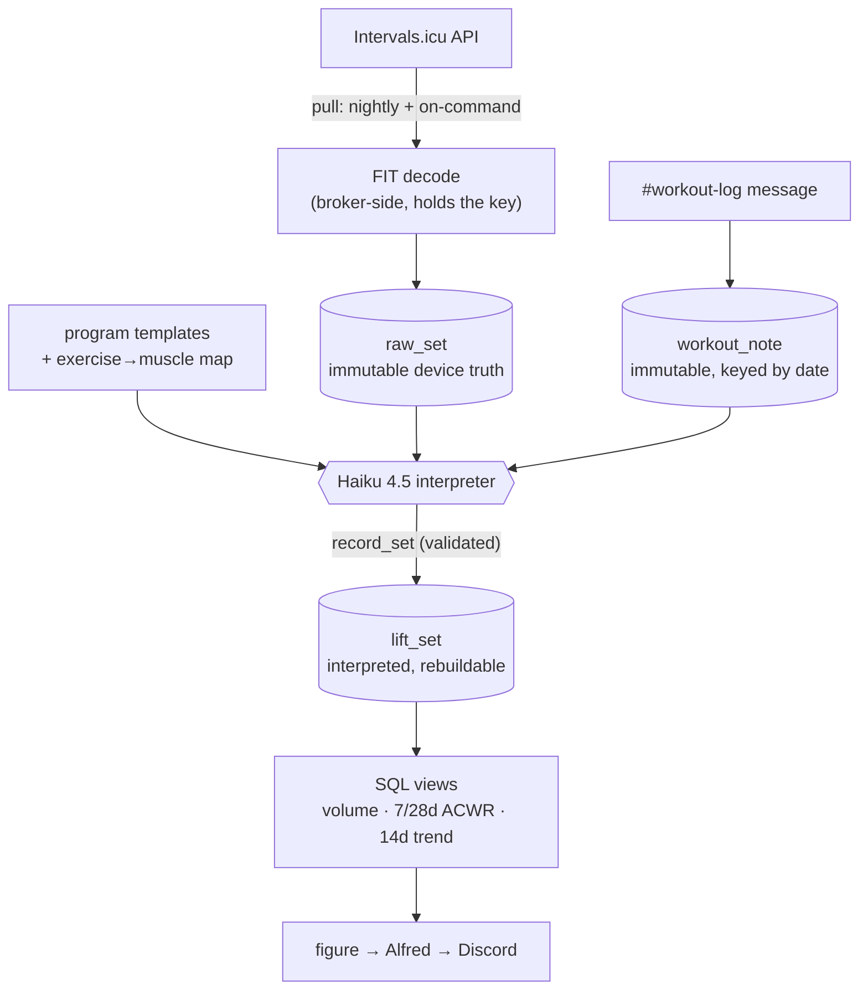

# Strength Load — Design

Rolling per-muscle load and volume from Garmin strength workouts, pulled through
Intervals.icu, so progressive overload is trackable over 7-/28-day windows.

Status: **design, pre-implementation.** Builds on the read-only `intervals`
capability already in this branch (`intervals/client.js`, `bin/intervals.js`).

---

## Pipeline



The invariant: **ingest → store raw (immutable) → interpret (model, rebuildable)
→ derive (deterministic SQL).** Raw is never mutated; everything downstream can be
rebuilt from it, so a formula change or a better interpretation never re-ingests.

---

## Sync — pull-only, made robust

Intervals.icu is pull-only for us (webhooks need a public endpoint; the bot is on
a NAT'd laptop — same reason mail uses Pub/Sub pull). So:

- **Re-pull a rolling 30-day window** each run and **upsert** by `activity.id` /
  `(activity_id, set_idx)`. Idempotent and self-healing: a missed night or a late
  Connect edit is corrected by the next pull. No drifting cursor.
- **Two triggers, one code path:** nightly (bot.js scheduler) + on-command (Alfred
  fires it). They can't disagree.
- **Secrets stay put.** The API key lives in bot.js's broker. The **pull + FIT
  decode happen broker-side** (a route returns decoded raw sets as JSON); SQLite,
  the Haiku interpreter, and the views are all local and hold no secret.

---

## Data model

One SQLite database, `agent/var/strength.db` (personal, machine-local,
gitignored — the correct home). Built-in `node:sqlite` (Node 24), no native
dependency. FIT decoding via `@garmin/fitsdk` (pure JS, already validated).

| table | role | mutability |
|---|---|---|
| `workout` | master row per activity: `id`, `date`, `type`, `style`, `synced_at` | upserted |
| `raw_set` | every set the FIT gave us: `activity_id`, `set_idx`, `watch_category`, `reps`, `weight_kg`, `rest_sec`, `hr…` | **immutable** |
| `lift_set` | interpreted: `activity_id`, `set_idx`, `exercise`, `reps`, `weight_lb`, `source`, `confidence` | model-written, rebuildable |
| `set_muscle` | per-set muscle attribution: `activity_id`, `set_idx`, `muscle`, `factor` | derived with `lift_set` |
| `cardio` | non-lifting activities: `activity_id`, `type`, `duration`, `distance`, `hr…`, `icu_load` | upserted |
| `workout_note` | free-text note from `#workout-log`: `received_at`, `note_date`, `text` — a sibling of `raw_set` in the raw layer | **immutable** |
| `exercise_map` | config: `exercise` → `[(muscle, factor)]` | editable config |
| `program_template` | config: the three programs, as ordered expectations | editable config |

Weights land as whole pounds (`weight_lb = round(weight_kg × 2.2046)`) — Garmin
stores kg at 1/16-kg precision; pounds are what was entered.

---

## The interpreter — headless Claude Haiku 4.5

Runs nightly on new workouts, and on demand when Alfred fires it. **Independent of
Alfred** so nightly runs need no conversation.

- **Input:** the workout's `raw_set` rows as JSONL, the three `program_template`s,
  the `exercise_map`, and any `workout_note` near that date.
- **Reasons over the whole session** — this is what handles skips and subs
  ("legs, but RDLs missing → skipped; split squats present").
- **Matches the note to the workout.** The note is raw and immutable but *not* a
  column on the workout row — at arrival the workout may not be synced yet, and a
  day can hold two workouts, so a date-join is wrong. The interpreter resolves the
  link by arrival time + the note's content and stamps `workout.note_id`. A note
  with no workout stays unmatched (harmless); we never fabricate a workout.
- **Output:** one `record_set` tool call per **working** set —
  `{set_idx, exercise, muscle_contributions:[{muscle, factor}], reps, weight_lb, confidence}`.
  Validated on the way in against `exercise_map`.
- **Rules:** drop misfires (`reps == 0 OR weight == 0`) — still visible in
  `raw_set`. A "to-failure" set is **not** a misfire (reps > 0). An exercise not in
  the map is **flagged for review**, not guessed into a number.
- Writes `lift_set` + `set_muscle` only. Re-runnable any time.

---

## Metrics

**Volume load**, per set, per muscle — assist-scaled:

```
contribution = factor × reps × weight_lb
```

**Weekly fractional set count**, per muscle: `Σ factor` over that muscle's sets.
One `factor` drives both.

### exercise → muscle factor map (confirmed)

| exercise | contributions |
|---|---|
| Back squat · Bulgarian split squat | Legs 1.0 |
| Barbell RDL | Legs 1.0 · Back 0.5 |
| Rope pushdown · OH rope extension · machine pushdown | Triceps 1.0 |
| Rope curl · hammer curl · preacher curl | Biceps 1.0 |
| Side delt raise | Shoulders 1.0 |
| Seated OHP | Shoulders 1.0 · Triceps 0.5 |
| Machine chest press · DB incline press | Chest 1.0 · Triceps 0.5 · Shoulders 0.5 |
| Wide/supinated lat pulldown · machine row | Back 1.0 · Biceps 0.5 |

Muscle groups: **Biceps · Triceps · Shoulders · Chest · Whole back · Whole legs.**

### programs (interpreter context)

- **Leg day** — 3× heavy squat · 2× barbell RDL · 2× Bulgarian split squat
- **Arms day** — Superset A ×3 [side delts→fail · lighter side delts · rope
  pushdown]; Superset B ×3 [heavy rope curl · lighter rope curl · OH extension];
  then 2× seated OHP · 3× hammer curl · 2× machine pushdown · 2× preacher curl
- **Chest & back** — 3× wide pulldown · 3× supinated pulldown · 2× machine chest
  press · 3× wide machine row · 3× DB incline press

---

## Views (deterministic; change without re-ingest)

| view | gives |
|---|---|
| `v_set_load` | per set: `factor × reps × weight_lb` per muscle |
| `v_daily_load` | daily volume per muscle + whole-body |
| `v_rolling` | **7-day acute**, **28-day chronic**, **ACWR ratio**, **14-day trend** — per muscle + whole-body |
| `v_weekly_sets` | fractional weekly set count per muscle |

ACWR (acute:chronic workload ratio) is the sports-science framing of "rolling
average of load": ~0.8–1.3 is the maintenance/overload band, spikes read high.

---

## Alfred's surface

A `strength` skill + `bin/strength.js`:

- `strength digest [--since DATE]` — fire the pull → interpret → compute pipeline
  (what Alfred runs on "can you see my new workout?"; nightly runs it too).
- `strength load [--muscle M] [--window 7|28]` — read the rolling figures.
- `strength sets <activityId>` — one workout's interpreted sets.
- `strength plot [--muscle M] [--window 7|28]` — render the rolling-load / ACWR /
  trend chart to a PNG; Alfred sends it to Discord via `{img:path}`.

Skill triggers written for phrasing: "how's my volume", "triceps load lately",
"did my workout log", "am I progressing", "how much have I trained this week".

---

## Open items

1. Confirm final column sets per table.
2. How Alfred **phrases** a load figure back (raw numbers vs. trend sentence).
3. Whether non-lifting `icu_load` ever folds into a whole-body ACWR (parked; kept
   separate for now).
4. Nightly scheduler mechanism in bot.js (reuse whatever drives the existing
   nightly pass).
